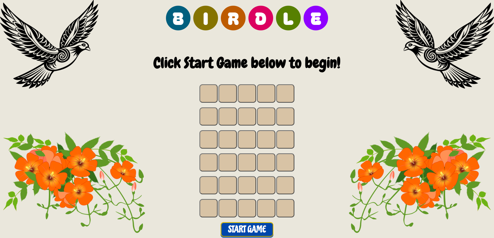

# Birdle - the Bird-Themed Wordle

Welcome to **Birdle**, the game of Wordle with a bird theme!

To play the game, you must guess the word the game has chosen within six tries. When you input a word and submit, then you are told if your word was the correct one or not. If not:

* If a letter is in the correct position of your guessed word and the correct word, it will show up in a green background on the grid. 🟩
* If a letter is included in the correct word, but has not been placed in the correct position, it will appear with a yellow background. 🟨
* If a letter in the guessed word is not in the correct word at all, it will appear with a gray background. ⬛️

If you guess the correct word within six tries, you win!

I chose the bird theme because of my enjoyment of birdwatching. Not all words are bird-themed, but quite a few of them are.

## 🚀 Getting Started

The game can be accessed [here](https://p-tigris.github.io/wordle-game/). 

### 📝 Instructions:

1. A dialog box will appear upon opening the app. Read the instructions and close the box.
2. Click on **Start Game** to begin.
3. A keyboard will appear. Use it to input your word guesses.
4. Use the **backspace** key to modify your word if necessary.
5. Click on **Submit** when you are ready to confirm a word for checking.

> Note: The user must input a word that the game recognizes in its data. If such a word is invalid, the user must use backspace and enter a new word in order to continue playing.

📋 Planning materials included [here](https://docs.google.com/document/d/1-9-ayT5T3FycCB00tVZo1IY1-TwcopLKcGYY_j8FOFw/edit?tab=t.0).

## Attributions

**Fonts:** [Google Fonts](https://fonts.google.com/).

**Images:** [Pixabay](https://pixabay.com/). Images are freely available to the public.

**Library:** [Mozilla Developer Network](https://developer.mozilla.org/en-US/).

## 🛠️ Technologies Used

This app was created with HTML, CSS and JavaScript. It is heavily focused on DOM manipulation, particularly in creating dynamic elements and manipulating them through various functions.

AI was used for the purposes of some debugging assistance and help with style choices, but the overall design and development was done by me.

## 🔜 Next Steps

* The biggest limitation of this app is the amount of data it contains; There can only be so many games played before the words are repeated. API integration would be the next step to gain access to larger databases.

* Another possible next step would be to implement a two-player system for the app, which would allow users to play against each other to guess the correct word. This may involve the implementation of 
    * A timer 
    * A scoreboard
    * Server hosting